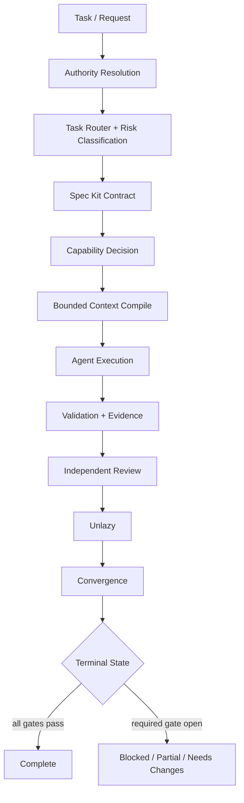

<div align="center">

# 🥭 Alimango AI Governance Lab

### Open reference control plane for governed AI-agent engineering

[](VERSION)
[](docs/ADOPTION-BOUNDARY.md)
[](.agents/README.md)
[](.github/workflows/public-hygiene.yml)
[](LICENSE)
[](CONTRIBUTING.md)

**Spec-driven engineering · fail-closed actions · capability control · bounded context · evidence gates · adversarial review · Unlazy · convergence**

This repository publishes a complete, public-safe reference implementation of the control ideas used to govern AI coding and engineering agents.

</div>

---

> [!IMPORTANT]
> **This repository is not Alimango production governance.** It is a public research, reference, and contribution surface. Production Alimango projects do not consume it as authority or as a runtime fallback. Useful ideas are independently re-derived and validated in the private governance system before any production adoption.

## Why this exists

AI agents are useful precisely because they can act. That also means quality cannot depend on a model remembering a long prompt or sounding confident. The control plane needs explicit authority, permissions, context provenance, executable evidence, independent challenge, and terminal-state discipline.

This lab makes those controls inspectable, executable, testable, and improvable in public.

## Control plane



The model is intentionally **not** the policy engine. Models propose actions. Governance decides whether those actions are authorized and whether the evidence is sufficient.

## What is included

| Control family | Reference implementation |
| --- | --- |
| **Constitution / authority** | `.specify/memory/constitution.md`, `AGENTS.md`, `GOVERNANCE.md`, `control/source-authority.json` |
| **Spec Kit** | `.specify/templates/`, `.agents/workflows/spec-kit.md`, executable spec fixture/checker |
| **Task routing** | `.agents/skills/task-router/` plus risk/capability classification |
| **Action governance** | capability classes, R0–R4 risk, allow/approval/deny policy, evaluator CLI |
| **Human approval** | scoped approval semantics for material side effects |
| **Tool contracts** | typed schema for scope, side effects, auth, destinations, pre/postconditions |
| **Context governance** | authority-aware RAG/CAG, provenance, freshness, sensitivity, budgets, compiler CLI |
| **Supply-chain controls** | source/ref/license/install/network/permission review + external-adoption harness |
| **Done-When / Proof** | acceptance gates defined before implementation |
| **Independent review** | read-only adversarial challenge with structured verdicts |
| **Audit kernel** | deterministic review inputs, coverage, findings, evidence and fingerprints |
| **Unlazy** | final anti-shortcut completion gate + executable checker |
| **Convergence** | reconciliation of spec, tasks, gates, evidence, review, and reality |
| **Lifecycle / cancellation** | explicit states, retry bounds, delegation and terminal outcomes |
| **Roles / multi-agent work** | researcher, implementer, reviewers, release coordination, bounded parallelism |
| **Telemetry** | structured action, evidence, timing, retry, context and terminal-state events |
| **Security / privacy / network** | prompt injection, SSRF, secrets, data sensitivity, least capability |
| **Testing / performance / UI** | reusable quality policies with risk-proportional evidence |
| **Upgrade discipline** | version file, upgrade-manifest schema and controlled consumer reference model |

## Repository architecture

```text
AGENTS.md                     repo-local agent entry point
GOVERNANCE.md                 public-lab authority boundary
VERSION                       public reference version
.specify/
  memory/constitution.md      highest repo-local authority
  templates/                  Spec Kit contracts
.agents/
  manifest.json               machine-readable control registry
  policies/                   standing constraints
  workflows/                  execution state machines
  skills/                     reusable agent methods
  roles/                      bounded agent role profiles
control/                      machine-readable authority/action/context policy
harness/                      audit, context, capability, skill-TDD, adoption, parallel-work contracts
schemas/                      typed tool/action/context/evidence/review/event/upgrade contracts
templates/consumer/           private-governance consumer reference patterns
scripts/                      deterministic validators + reference governance CLIs
tests/                        executable governance regression tests
examples/                     synthetic tools, context, review, and completed Spec Kit fixture
docs/                         architecture, threats, controls, lifecycle, security, contributor guides
proposals/                    Alimango Governance Proposal (AGP) records
.github/                      contribution templates + governance CI
```

## Run the reference harness

No third-party Python package is required for the core checks.

```bash
python scripts/validate_public_lab.py
python scripts/validate_agent_controls.py
python scripts/capability_doctor.py --require python --require AGENTS.md
python scripts/spec_check.py examples/specs/001-capability-contract
python scripts/unlazy_check.py examples/specs/001-capability-contract
python scripts/compile_context.py --request examples/context-request.json
python -m unittest discover -s tests -p 'test_*.py' -v
```

Or on systems with `make`:

```bash
make validate
make test
make fingerprint
```

## The operating model

```text
public idea / issue / PR
        │
        ▼
public experiment + skeptical review
        │
        ├── weak / unsafe / redundant ──► reject or close
        │
        └── useful ──► retain as public reference
                           │
                           ▼
                  independent private re-derivation
                           │
                           ▼
                  private tests + audit + versioning
                           │
                           ▼
                    possible production adoption
```

A merge here means **useful enough to retain publicly**. It does not mean adopted as Alimango production governance.

## Design principles

We prefer controls that are difficult to hand-wave around:

```text
executable proof
  > deterministic validator
    > typed contract / schema
      > capability boundary
        > reviewable workflow
          > prose reminder
```

Strong contributions usually identify a concrete failure mode, propose the smallest enforceable control, include negative-path evidence, state capability/context costs, and document bypasses or limitations.

## Quick start

Read [`AGENTS.md`](AGENTS.md) to understand how agents are governed in this repo, then [`docs/AGENT-CONTROL-PLANE.md`](docs/AGENT-CONTROL-PLANE.md) for the architecture. For a concrete change, use the Spec Kit templates under [`.specify/templates/`](.specify/templates/) and follow [`CONTRIBUTING.md`](CONTRIBUTING.md).

Useful starting points:

- [`docs/SPEC-KIT.md`](docs/SPEC-KIT.md)
- [`docs/UNLAZY.md`](docs/UNLAZY.md)
- [`docs/THREAT-MODEL.md`](docs/THREAT-MODEL.md)
- [`docs/CONTROL-MATRIX.md`](docs/CONTROL-MATRIX.md)
- [`docs/TOOL-CONTRACTS.md`](docs/TOOL-CONTRACTS.md)
- [`docs/CONTEXT-ENGINEERING.md`](docs/CONTEXT-ENGINEERING.md)
- [`docs/INDEPENDENT-REVIEW.md`](docs/INDEPENDENT-REVIEW.md)
- [`docs/FAILURE-MODE-CATALOG.md`](docs/FAILURE-MODE-CATALOG.md)
- [`docs/CONSUMER-MODEL.md`](docs/CONSUMER-MODEL.md)

## What we want contributions on

Agent permissions and approvals; prompt/tool injection defenses; context selection and cache invalidation; code-graph/RAG/CAG controls; deterministic validators; agent lifecycle/cancellation; independent reviewer methods; supply-chain verification; provenance; typed tool interfaces; test/evidence quality; token/latency budgets; host adapters; and new reproducible failure cases.

## Contribution boundary

Never submit credentials, keys, private Alimango code, customer/tenant/patient data, proprietary project internals, or a mechanism that automatically promotes public content into private production governance. See [`docs/ADOPTION-BOUNDARY.md`](docs/ADOPTION-BOUNDARY.md) and [`SECURITY.md`](SECURITY.md).

---

<div align="center">

### Build agent governance that survives skeptical review.

**Open controls. Explicit evidence. Private production authority.**

</div>
