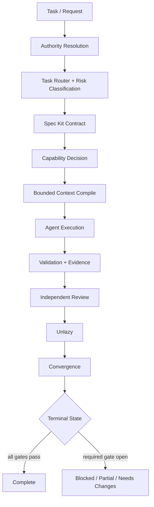

<div align="center">

# 🥭 Alimango AI Governance Lab

### Open public-good control plane for governed AI-agent engineering

[](VERSION)
[](docs/PUBLIC-SCOPE.md)
[](.agents/README.md)
[](.github/workflows/public-hygiene.yml)
[](LICENSE)
[](CONTRIBUTING.md)

**Spec-driven engineering · fail-closed actions · capability control · bounded context · evidence gates · adversarial review · Unlazy · convergence**

A self-contained, inspectable, executable reference implementation for governing AI coding and engineering agents.

</div>

---

> [!IMPORTANT]
> This repository is designed as **public goods**. Everything required to understand the published control model should be explainable from public material in this repository. Documentation and examples must not depend on, identify, or imply confidential projects, repositories, deployments, customers, environments, or organizational topology.

## Why this exists

AI agents are useful because they can act. That means reliability cannot depend on a model remembering a long prompt or sounding confident. A useful control plane needs explicit authority, bounded permissions, context provenance, executable evidence, independent challenge, and terminal-state discipline.

This project makes those controls inspectable, executable, testable, portable, and improvable in public.

## Control plane



The model is intentionally **not** the policy engine. Models propose actions. Governance determines whether actions are authorized and whether evidence is sufficient.

## What is included

| Control family | Reference implementation |
| --- | --- |
| **Constitution / authority** | `.specify/memory/constitution.md`, `AGENTS.md`, `GOVERNANCE.md`, `control/source-authority.json` |
| **Spec Kit** | `.specify/templates/`, `.agents/workflows/spec-kit.md`, executable spec fixture/checker |
| **Task routing** | `.agents/skills/task-router/` plus risk/capability classification |
| **Action governance** | capability classes, R0–R4 risk, allow/approval/deny policy, evaluator CLI |
| **Human approval** | scoped approval semantics for material side effects |
| **Tool contracts** | typed schema for scope, side effects, auth, destinations, pre/postconditions |
| **Context governance** | authority-aware RAG/CAG, provenance, freshness, sensitivity, budgets, compiler CLI |
| **Supply-chain controls** | source/ref/license/install/network/permission review + external-adoption harness |
| **Done-When / Proof** | acceptance gates defined before implementation |
| **Independent review** | read-only adversarial challenge with structured verdicts |
| **Audit kernel** | deterministic review inputs, coverage, findings, evidence and fingerprints |
| **Unlazy** | final anti-shortcut completion gate + executable checker |
| **Convergence** | reconciliation of spec, tasks, gates, evidence, review, and reality |
| **Lifecycle / cancellation** | explicit states, retry bounds, delegation and terminal outcomes |
| **Roles / multi-agent work** | researcher, analyst, writer, implementer, reviewers, release coordination |
| **Telemetry** | structured action, evidence, timing, retry, context and terminal-state events |
| **Security / privacy / network** | prompt injection, SSRF, secrets, isolation, sensitivity, least capability |
| **Testing / performance / UI** | reusable quality policies with risk-proportional evidence |
| **Upgrade discipline** | version file, upgrade-manifest schema and pinned revision patterns |

## Repository architecture

```text
AGENTS.md                     repo-local agent entry point
CLAUDE.md                     Claude Code host shim
GOVERNANCE.md                 project governance charter
VERSION                       public reference version
.specify/
  memory/constitution.md      highest repo-local authority
  templates/                  Spec Kit contracts
.agents/
  manifest.json               machine-readable control registry
  policies/                   standing constraints
  workflows/                  execution state machines
  skills/                     reusable agent methods
  roles/                      bounded agent role profiles
adapters/                     model/host adapter reference patterns
control/                      machine-readable authority/action/context policy
harness/                      audit, context, capability, skill-TDD, adoption, parallel-work contracts
schemas/                      typed tool/action/context/evidence/review/event/exception/upgrade contracts
templates/consumer/           portable adopter/reference patterns
scripts/                      deterministic validators + reference governance CLIs
tests/                        executable governance regression/adversarial tests
examples/                     synthetic tools, context, review, and completed Spec Kit fixture
proposals/                    governance design proposals
experiments/                  reproducible public-safe experiment protocol
benchmarks/                   governance effectiveness + cost metrics
docs/                         architecture, threats, controls, lifecycle, security, contributor guides
.github/                      issue/PR templates, host instructions, governance CI
```

## Run the reference harness

Core checks require only Python 3.11+.

```bash
python scripts/validate_public_lab.py
python scripts/validate_agent_controls.py
python scripts/capability_doctor.py --require python --require AGENTS.md
python scripts/spec_check.py examples/specs/001-capability-contract
python scripts/unlazy_check.py examples/specs/001-capability-contract
python scripts/compile_context.py --request examples/context-request.json
python -m unittest discover -s tests -p 'test_*.py' -v
```

Or:

```bash
make validate
make test
make fingerprint
```

## Core proposals

| Proposal | Problem it attacks |
| --- | --- |
| [`AGP-001`](proposals/AGP-001-capability-gated-tool-execution.md) | agents confusing tool availability with authorization |
| [`AGP-002`](proposals/AGP-002-authority-aware-context-compilation.md) | stale, poisoned, or unbounded context and authority confusion |
| [`AGP-003`](proposals/AGP-003-evidence-gated-completion.md) | false completion, skipped gates, and evidence drift |

These are reference designs intended to be challenged, measured, and improved.

## Contribution lifecycle

```text
idea / failure case
      ↓
issue / proposal
      ↓
small enforceable control
      ↓
positive + negative evidence
      ↓
independent challenge
      ↓
CI + convergence + Unlazy
      ↓
merge / release
```

A merge means the change has met this repository's contribution and validation requirements for the merged revision.

## Use it as public goods

You may study, fork, adapt, vendor, or pin this project under the Apache-2.0 license. Keep local product constraints and sensitive implementation details outside public contributions. If you integrate a revision elsewhere, pin the exact revision and preserve the authority, capability, evidence, and fail-closed semantics that matter to your use case.

See [`docs/CONSUMER-MODEL.md`](docs/CONSUMER-MODEL.md) for a portable integration pattern.

## Contribute to an open research track

- [Capability-escalation adversarial fixtures](https://github.com/AlimangoStudio/Alimango-ai-governance/issues/4)
- [Bounded-context vs whole-repo benchmark](https://github.com/AlimangoStudio/Alimango-ai-governance/issues/5)
- [MCP / connector typed-contract fixtures](https://github.com/AlimangoStudio/Alimango-ai-governance/issues/6)
- [Stale-context and cache-poisoning tests](https://github.com/AlimangoStudio/Alimango-ai-governance/issues/7)

Start with [`docs/CONTRIBUTOR-QUICKSTART.md`](docs/CONTRIBUTOR-QUICKSTART.md), the [`proposal template`](proposals/PROPOSAL-TEMPLATE.md), or the [`experiment template`](experiments/EXPERIMENT-TEMPLATE.md).

## Technical references

- [`docs/PUBLIC-SCOPE.md`](docs/PUBLIC-SCOPE.md)
- [`docs/SPEC-KIT.md`](docs/SPEC-KIT.md)
- [`docs/UNLAZY.md`](docs/UNLAZY.md)
- [`docs/THREAT-MODEL.md`](docs/THREAT-MODEL.md)
- [`docs/CONTROL-MATRIX.md`](docs/CONTROL-MATRIX.md)
- [`docs/TOOL-CONTRACTS.md`](docs/TOOL-CONTRACTS.md)
- [`docs/CONTEXT-ENGINEERING.md`](docs/CONTEXT-ENGINEERING.md)
- [`docs/INDEPENDENT-REVIEW.md`](docs/INDEPENDENT-REVIEW.md)
- [`docs/MCP-AND-CONNECTORS.md`](docs/MCP-AND-CONNECTORS.md)
- [`docs/FAILURE-MODE-CATALOG.md`](docs/FAILURE-MODE-CATALOG.md)
- [`docs/CONSUMER-MODEL.md`](docs/CONSUMER-MODEL.md)

## Public-scope rule

Do not submit credentials, keys, personal/customer data, confidential source, proprietary implementation details, non-public endpoints, or organizational topology. Use synthetic examples and public references. See [`docs/PUBLIC-SCOPE.md`](docs/PUBLIC-SCOPE.md) and [`SECURITY.md`](SECURITY.md).

---

<div align="center">

### Build agent governance that survives skeptical review.

**Open controls. Explicit evidence. Portable public goods.**

</div>
